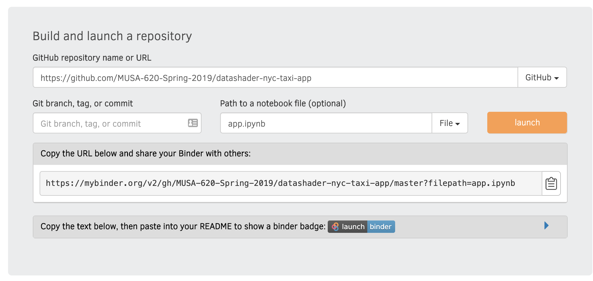
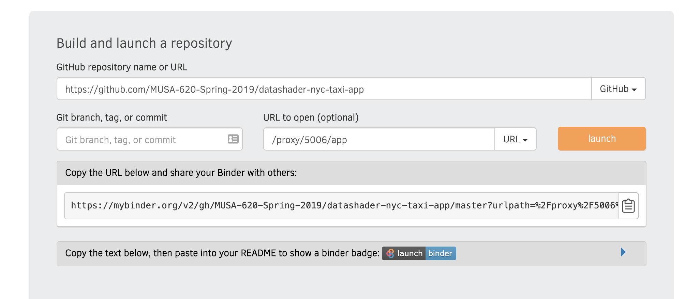

# Deployment Options

## Flask/Dash Apps

Several Platform as a Service (PaaS) options exist for hosting a web app. [Heroku](https://www.heroku.com/) and Amazon Web Services are the most common, but they have a **steep** learning curve.

**Best solution:** [PythonAnywhere](https://pythonanywhere.com):

- You can host 1 free web app with about 1 GB of storage for free: [see their pricing page](https://www.pythonanywhere.com/pricing/)
- Designed for Flask apps: see [this tutorial](https://help.pythonanywhere.com/pages/Flask/) on setting up a Flask app.

Recommended Workflow: design and test locally and then once everything is working, follow the above steps to upload your code to PythonAnywhere.

## Panel Apps

Panel is based on Bokeh, which has a built-in server (separate from Flask) that requires web socket communication.

This is not currently possible on PythonAnywhere.

It is possible with Heroku, but Heroku's doesn't do file storage, e.g., you can't host any data files locally to be loaded by your app, which makes things overly complicated.

**Best solution:** Binder

- the example Panel apps provide options to launch the apps from the GitHub repositories on Binder
- a free service!
- a reasonable amount of free storage provided, e.g., enough to host the dataset of 1 million taxi trips

To generate custom links for your Binder apps that say `launch app` and `launch notebook` using
[this page](https://mybinder.readthedocs.io/en/latest/howto/badges.html)

You can create the link for your app from the Binder homepage: https://mybinder.org/

You'll want to create two links:

#### The `app.ipynb` notebook:

- Enter your repository URL
- Specify the **file path** as `app.ipynb`

#### The URL for the app itself:

- Enter your repository URL
- Specify the **URL path** as `/proxy/5006/app`

